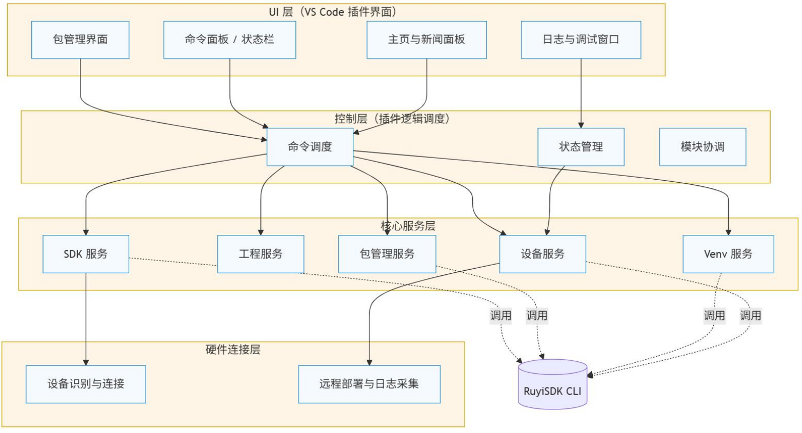
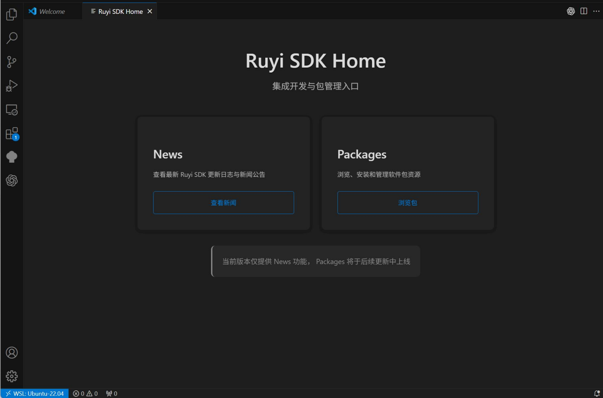
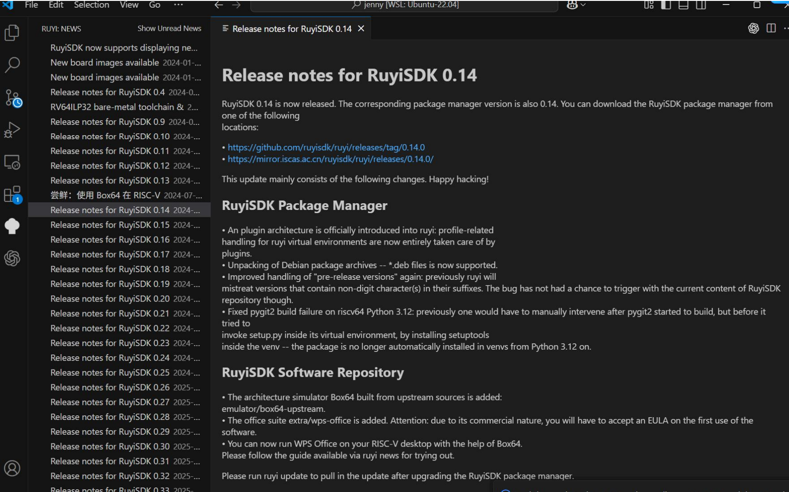
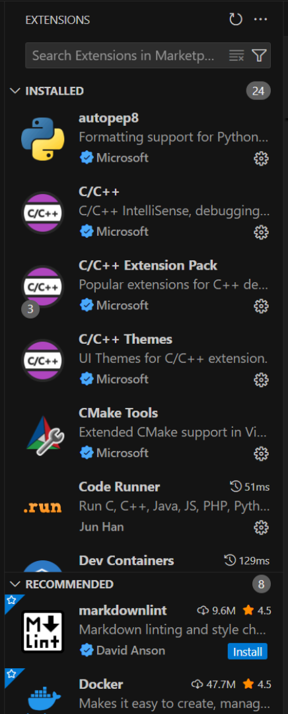

# RISC-V VSCode 插件设计书
Author：ddsfda99

## 一、总体目标
构建面向 RISC-V 的一站式开发环境插件，在 VS Code 内集成 RuyiSDK 的包管理、项目构建、设备部署与调试功能，实现从 SDK 安装、工程创建到编译、运行、调试、部署的完整开发流程。
以 RuyiSDK 为核心，统一工具链、包、镜像与工程模板，提供轻量化、自动化的开发体验，使开发者无需频繁切换命令行即可完成软硬件一体的 RISC-V 开发与验证。

## 二、具体目标
| 模块方向           | 功能目标          | 主要说明                                                               |
| -------------- | ------------- | ------------------------------------------------------------------ |
| 工具集成   | 一站式 SDK 与环境管理 | 在 VS Code 内实现 RuyiSDK 的检测、安装、包管理、镜像源管理、新闻公告、版本更新与环境配置等功能，提供图形化操作面板与命令面板入口，简化命令行操作并增强可视化体验。 |
| 工程化支持  | 自动化项目构建与调试配置  | 提供 RISC-V 项目创建、构建与调试的一体化支持，包括模板化工程生成、自动任务配置与调试预设，支持跨平台（Windows、macOS、Linux）一致的开发与运行体验。 |
| 硬件连接    | 远程部署与运行监控     | 支持 RISC-V 开发板的远程部署、程序运行与日志查看，实现软硬件一体化开发。    |

## 三、系统架构
本系统整体架构采用分层设计，主要包括 UI 层、控制层、核心服务层和硬件连接层四个部分。各层之间通过明确定义的接口进行交互，形成清晰、松耦合的体系结构。

**1. UI 层（VS Code 插件界面）**
提供用户交互入口，包括包管理面板、命令面板、状态栏及日志窗口。
负责展示 SDK 包信息、执行命令结果与调试日志，是用户与系统交互的主要界面。

**2. 控制层（插件逻辑）**
负责协调系统内部各模块的运行。接收来自 UI 的操作指令，进行命令调度、状态管理与错误处理。
该层是系统的中枢，负责把用户操作转换为核心服务调用，并维护运行状态的一致性。

**3. 核心服务层**
是插件的主要功能实现部分，包含以下子模块：
- SDK 服务：提供 SDK 检测、安装、包管理、镜像源与配置管理。
- 工程服务：负责项目创建、构建任务与调试配置自动生成，实现工程化支持。

**4. 硬件连接层**
实现与 RISC-V 开发板的直接交互，提供设备连接、远程部署与运行日志采集功能，支持软硬件一体化开发。

**系统架构图**


## 四、模块功能说明
### 1. 主页仪表盘（Home）
**目标**
Home 模块在插件启动后作为统一入口界面，负责以简洁、美观的方式呈现 RuyiSDK 的主要功能入口。用户打开插件即可看到当前版本可用的功能模块（如 News、Packages 等），并通过统一的导航界面进入对应子模块。界面整体采用轻量化设计，同时在视觉与布局上延续 VS Code 原生风格，实现插件整体风格的一致性与可扩展性。
**具体功能**
| 功能项                 | 设计说明                                                                     |
| ------------------- | ------------------------------------------------------------------------ |
| 1. News 新闻公告    | 提供 RuyiSDK 新闻公告入口。点击后跳转至 `NewsPanel` 视图查看最新更新与版本日志。界面保持简洁，仅展示入口和说明文字。    |
| 2. Packages 包管理 | 提供包管理模块的入口，当前版本显示“Packages 功能即将上线”提示，保留跳转逻辑与布局结构，为后续扩展预留位置。              |
| 3. 系统提示信息       | 插件启动时自动加载功能可用状态（例如 RuyiSDK 环境检测结果），并以提示文本方式展示当前版本支持的功能范围。                |
| 4. 所有功能模块导航与统一风格    | Home 模块统一注册 News、Packages、Devices、Settings 等功能入口，保持样式与导航行为一致，形成插件的主界面中心。 |

**当前效果图**


### 2. 新闻展示（News）（已完成一部分）
**目标**
News 模块用于展示 RuyiSDK 的最新动态、版本更新日志与公告信息，是用户了解 SDK 更新内容的主要窗口。模块设计追求信息呈现清晰、交互简单，采用轻量化加载与卡片化布局，使用户能够快速浏览新闻概要，并在需要时查看详细内容。
**具体功能**
| 功能项             | 设计说明                                                              |
| --------------- | ----------------------------------------------------------------- |
| 1. 新闻列表展示  | 调用后端或本地缓存的 RuyiSDK 新闻数据，按时间顺序以卡片形式展示标题、日期与摘要。 |
| 2. 新闻详情查看  | 用户点击新闻卡片后加载详情页，展示完整公告正文、版本变更信息或外部链接内容。                            |
| 3. 数据更新机制   | 模块启动时通过 RuyiNewsService 自动获取最新新闻数据；在无网络环境下自动读取本地缓存，并在后台周期性同步最新内容，确保展示数据始终保持最新状态。       |
| 4. 消息状态标识  | 对未读新闻以视觉样式标识（如加粗、角标），阅读后自动更新为已读并同步到本地存储。                        |
| 5. 关键字搜索与筛选 | 提供搜索栏，用户可根据模块名称、版本号或发布时间筛选公告，提高内容定位效率。                            |
| 6. 通知系统集成   | 与 VS Code 消息中心联动，当有新公告发布时触发弹窗提醒，点击后可直接打开对应详情页。                    |

**当前效果图**


### 3. 包管理（Packages）
**目标**
Packages 模块用于展示、搜索和管理 RuyiSDK 的软件包，是开发者进行 SDK 扩展与依赖管理的核心界面。模块通过可视化的包列表与操作入口，帮助用户完成包的安装、更新、卸载及版本管理。
**具体功能**
| 功能项             | 设计说明                                                                                         |
| --------------- | -------------------------------------------------------------------------------------------- |
| 1. 包列表展示    | 通过 `RuyiPackageService` 获取包索引数据与本地安装数据，显示包名、版本、来源与安装状态（已安装 / 可更新 / 未安装）。支持分页与懒加载。               |
| 2. 包搜索与筛选   | 提供搜索栏与筛选条件，用户可根据包名、来源、版本或关键字查询包信息。                             |
| 3. 包安装与卸载   | 支持一键安装与卸载操作，通过调用 RuyiSDK CLI 接口执行实际命令（`ruyi install`、`ruyi uninstall`）。执行结果实时回传并在界面中展示进度与日志。 |
| 4. 包更新与版本管理 | 自动检测包更新情况，在包卡片上提示可更新状态；用户可选择更新单个包或全部包，支持回滚至历史版本。                                           |
| 5. 包源与镜像管理  | 模块启动时读取当前镜像源配置，并允许用户切换官方源、社区源或自定义源地址。                       |

**目标效果图**


### 4. 虚拟环境管理（Venv）
**目标**
Venv 模块用于在 VS Code 内创建、激活和管理 RuyiSDK 虚拟环境，为不同项目提供相互隔离、可复现的工具链与包集合。模块在启动时自动检测可用环境，绑定工作区作用域，并将当前环境统一应用于构建、包管理与设备部署流程。
**具体功能**
| 功能项        | 设计说明                                                                                                                                                             |
| ---------- | ---------------------------------------------------------------------------------------------------------------------------------------------------------------- |
| 1. 环境检测    | 启动时自动扫描已存在的 Ruyi 虚拟环境，读取名称、关联 profile、SDK 版本与已安装包信息。                                                                                                             |
| 2. 环境创建    | 通过对话框创建新环境，参数包括：<br>• Profile（从 `ruyi list profiles` 获取）<br>• Toolchain（交叉编译工具链选择）<br>• Emulator（如 QEMU、Spike）<br>• 可选镜像源与初始包。<br>创建过程自动校验依赖并支持失败回滚。 |
| 3. 删除与清理   | 支持删除未被工作区占用的环境，并在清理前确认依赖关系与引用状态。                                                                                                                                 |
| 4. 激活与切换   | 将选定环境设为当前工作区环境，自动更新 PATH、构建配置与调试参数。                                                                                                                              |
| 5. 包管理联动   | 包的安装、更新与卸载均在当前激活环境中执行，切换后自动刷新状态。                                                                                                                                 |
| 6. 终端与任务集成 | 打开终端或执行任务时自动注入环境变量与工具链路径，确保构建一致性。                                                                                                                                |

### 5. 设备连接与远程部署（Devices）
**目标**
Devices 模块是 RISC-V VS Code 插件实现软硬件一体化开发的核心部分，覆盖从镜像烧录、设备检测到程序部署与远程调试的完整流程。模块以“即插即用、可视化、稳定通信”为设计原则，支持自动识别设备、执行部署与运行监控，为开发者提供统一直观的硬件操作体验，并保持与其他模块一致的界面风格。
**具体功能**
| 功能项         | 设计说明                                                                |
| ----------- | ------------------------------------------------------------------- |
| 1. 设备识别与管理  | 启动时自动扫描 USB、串口或局域网设备，显示名称、型号、连接方式和状态，支持手动刷新与断开检测。                   |
| 2. 镜像烧录     | 提供图形化烧录向导，支持选择本地或网络镜像文件、自动识别目标设备并执行写入；提供进度展示、完整性校验与安全弹出，弥补 `ruyi device provision` 在交互与验证上的不足。                             |
| 3. 程序部署     | 通过 `RuyiDeviceService` 一键上传并运行程序，自动执行编译、打包、传输与启动，结果与日志实时回显。         |
| 4. 日志与监控    | 集成实时日志窗口，展示设备运行输出，支持过滤、导出与关键字高亮。                                    |
| 5. 状态同步     | 后台周期性检测设备在线状态，自动刷新界面并更新连接信息。                                        |
| 6. 命令与多设备支持 | 提供统一命令接口，支持多设备并行管理与上下文切换。 |

### 6. 环境检测与安装管理（System Setup）（大致已完成）
**目标**
System Setup 模块用于检测和维护 RuyiSDK 的安装状态与运行环境。启动时自动检查 SDK 是否可用、版本是否匹配，以及镜像源是否能正常访问；必要时执行自动安装或更新，确保开发环境始终可用并提示用户版本变化。
**具体功能**
| 功能项            | 设计说明                                                     |
| -------------- | -------------------------------------------------------- |
| 1. SDK 检测与版本提示 | 启动时检测是否已安装 RuyiSDK，并显示当前版本；若检测到新版本，则在首页或状态栏提示用户更新。       |
| 2. 镜像源可用性检查    | 检测当前包镜像源（packages-index）是否能正常访问；若网络异常或镜像不可用，提示切换至备用源。    |
| 3. 自动安装与修复     | 当未检测到 RuyiSDK 或版本过旧时，自动执行安装或更新，支持在线下载与本地安装包两种方式，并实时显示进度。 |
| 4. 插件版本提示      | 检查 VS Code 插件自身版本，若有新版本可用，在主页提示用户更新。                     |                   

## 五、目录结构
本项目按功能与职责划分为命令层、特性层、公共工具层与输出层。整体结构清晰，支持模块化扩展与自动构建。
**总体结构**
```
ruyisdk-vscode-extension/
├── src/                 # TypeScript 源码目录
├── out/                 # 编译后 JS 产物目录（由 tsc 生成）
├── media/               # 静态资源（图标、脚本）
├── node_modules/        # 依赖包
├── package.json         # 插件清单与依赖定义
├── tsconfig.json        # TypeScript 编译配置
├── eslint.config.mjs    # ESLint 代码规范配置
├── icon.png             # 插件图标
├── LICENSE / README.md  # 许可证与说明文档
└── ruyisdk-vscode-extension-0.1.0.vsix # 打包生成的扩展文件
```
**源码结构**
```
src/
├── extension.ts              # 插件主入口，注册命令与模块
├── commands/                 # VS Code 命令注册与调用层
│   ├── detect.ts             # 注册 “Ruyi 检测” 命令
│   ├── home.ts               # 注册 “Home” 模块入口命令
│   ├── installRuyi.ts        # 注册 “Ruyi 安装” 命令
│   ├── news.ts               # 注册 “News 新闻” 命令
│   └── package.ts            # 注册 “Package 包管理” 命令
├── common/                   # 公共常量与工具函数
│   ├── constants.ts          # 全局常量与标识符定义
│   └── utils.ts              # 通用辅助函数（路径、日志、执行等）
└── features/                 # 各功能模块的实现逻辑
    ├── home/
    │   └── HomePanel.ts      # Home 模块视图与导航逻辑
    ├── news/
    │   ├── NewsPanel.ts      # 新闻展示主面板（UI 渲染）
    │   ├── NewsService.ts    # 新闻数据获取与缓存逻辑
    │   └── NewsTree.ts       # 树形结构展示组件
    ├── packages/
    │   └── PackagePanel.ts   # 包管理面板逻辑
    ├── detect/
    │   └── DetectService.ts  # Ruyi SDK 检测逻辑
    └── install/
        └── InstallService.ts # Ruyi SDK 安装服务
```
**静态资源（`media/`）**
```
media/
└── marked.umd.js             # Markdown 渲染库（用于 News/Package 页面展示）
```
此目录存放插件前端页面中使用的静态文件（脚本、样式、图标等）。
**项目构建与发布文件**
| 文件名                                     | 功能说明                                |
| --------------------------------------- | ----------------------------------- |
| package.json                        | 定义插件信息、命令、入口文件与依赖模块，是扩展运行的核心清单。     |
| tsconfig.json                       | 配置 TypeScript 编译规则与输出路径（src → out）。 |
| eslint.config.mjs                  | 定义项目的代码规范检查规则。                      |
| ruyisdk-vscode-extension-0.1.0.vsix | 插件打包生成的可安装文件，用于 VS Code 扩展市场或本地安装。  |

## 六、项目阶段规划
插件开发分为两个阶段：

第一阶段以虚拟环境（Venv）和包管理（Packages）为核心，完成虚拟环境的创建、激活与切换，以及软件包的展示、安装、更新和镜像源管理。Home 与 News 模块作为外围支持，提供统一入口与信息展示。

第二阶段聚焦设备连接与远程部署（Devices），实现镜像烧录、设备识别、程序部署、日志监控与调试功能，构建从 SDK 到硬件的完整开发链路。

