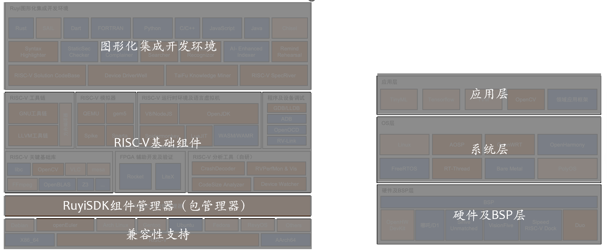

## 介绍

RUYISDK 是一个旨在提供给一个一体化集成开发环境的产品计划。从 2023 年开始筹备，计划用三年时间为 RISC-V 开发者提供一个完整的、全家桶式的全功能开发环境。

## RUYISDK 的目标

1. 开发者购买了 (几乎) 任何一款 RISC-V 开发板或模组，都可以通过 RUYISDK 系统获得硬件资料说明、固件 / 软件更新、调试支持等。
2. 开发者可以指定任何常用的 RISC-V 扩展指令集架构组合，都可以通过 RUYISDK 系统生成客户所需的操作系统、工具链、语言执行环境 (运行时或虚拟机)、计算库、应用框架等。尤其强调 RUYISDK 将完全支持 Vector 0.7.1 和 RVP 0.5.2 等已经大规模硅化的草案 标准 (or 厂商定制扩展)。
3. 培育运营一个活跃全面的开发者交流社区。

## RUYISDK 架构示意图


## RuyiSDK 的组成



```graph
    subgraph 开发者环境
        A[图形化集成开发环境]
        B[RISC-V基础组件]
        C[RuyiSDK组件管理器]
        D[兼容性支持]
    end
  
    subgraph 运行环境（RISC-V设备）
        E[应用层]
        F[系统层]
        G[硬件及BSP层]
    end

```

RuyiSDK 主要主要组成包括：

- RISC-V基础组件：RISC-V开发离不开基础开发工具对RISC-V的支持与适配。RISC-V基础组件包含了不限于 RISC-V编译工具链 、RISC-V模拟器、RISC-V关键基础库等等；
  基础组件在 RuyiSDK中，以RuyiSDK软件源管理的内容的形式存在，可以通过包管理器进行下载安装。
- 如意组件管理器包含一个在线软件源 （Ruyi repo） 和 一个包管理工具（ruyi）。在线软件源即如意Repo集中存储了RISC-V集成开发环境所需的编译工具链、调试工具、模拟器、运行环境、文档、代码、工具、target系统镜像等内容；包管理器工具则是用于与在线软件源交互的工具，它提供了一套命令行接口（ruyi）或图形用户界面（GUI未来可能提供），使开发者能够搜索、安装、更新和管理软件包。包管理工具负责从在线软件源中获取软件包的信息，解析软件包的依赖关系，并自动处理依赖关系的下载和安装。
- 如意图形化集成开发环境（Ruyi IDE）则是一个专门用来开发能够运行在RISC-V架构设备上的软件和应用的工具箱。可以帮助开发者编写和测试自己的程序。

  想象一下，你要做一款能够运行在RISC-V设备上的应用程序，比如用C或者C++语言开发一个图像识别的程序，Ruyi IDE 就像是一个你的工作室，里面有各种各样的工具可以帮助你完成这个任务。首先创建项目，从RuyiSDK包管理器中下载和安装所需的编译工具链、调试工具、模拟器等工具，然后在文本编辑器中完成对代码的编辑，接着对项目进行编译构建获得RISC-V架构的可执行程序，最后在模拟器或者RISC-V开发板上进行运行和测试。如果代码需要调试，也可通过调试工具进行代码调试。这一过程和x86下的开发、编译构建、调试、运行的流程是一致的，只是适用于当前开发语言及目标运行设备的RISC-V的编译工具链、模拟器等软件和工具都可以从如意包管理器中获取，在安装和IDE初始设置时都已经被集成到如意集成开发环境之中，用户无需为环境搭建耗费精力。
- 兼容性：RuyiSDK定义了其支持的架构和系统

  - 架构：X86_64、RISC-V、AArch64
  - 系统：以主流Linux为主，如 Debian、openEuler、Ubuntu、Arch Linux、Fedora、Gentoo等。
- 硬件及BSP层：主要定义RuyiSDK支持的RISC-V设备。RuyiSDK希望能够支持市面上能够买得到的几乎所有的RISC-V开发板。
- 系统层：适配了 RISC-V 开发板的各种系统。
- 应用层：运行于 RISC-V 设备上的各种应用。
- 如意开发者交流社区：为RISC-V开发者提供一个开放的交流平台，提供互助式技术支持和资源共享，聚集RISC-V开发者并推动RISC-V生态系统的发展。

此外，架构图中还规划了一些[自研工具](./ide-tools.md)
