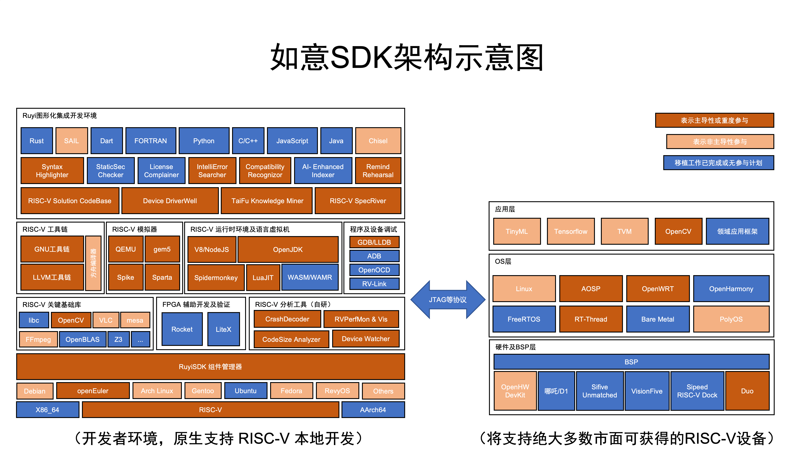
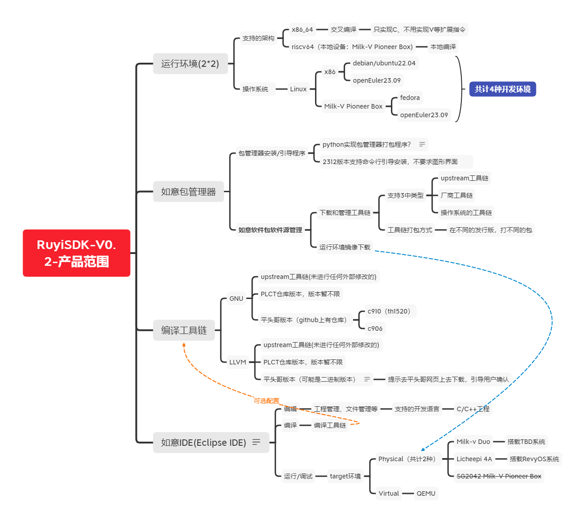

# RuyiSDK 需求说明

#### 文档阅读说明

本文站在用户使用的角度，描述从RuyiSDK产品获得什么功能和用户体验。
本文供RuyiSDK产品 项目组成员参考。用于了解产品整体概况和开发目标。

说明：

1. RuyiSDK产品是一款面向RISC-V集成开发环境的产品。一共分了6个里程碑结点，产品总体介绍详见[《RuyiSDK产品介绍》](https://github.com/xijing21/ruyi-pmd/blob/main/docs/process/intro/index.md)
2. 本文在产品的整体框架上，会重点定义RuyiSDK v0.2 (2312版本）的需求细节。
   此外，产品整体需求也是不断完善的过程，因此会采用查漏式、逐步细化的方式针对定义不明确的（针对开发、测试不理解）的部分进行定义。文档主要是为了指导项目组开发成员、测试人员工作，因此以开发、测试能够看懂为目标。
3. 本产品是一款面向大众的（RISC-V开发群体）的产品，所有参与项目直接开发或者潜在的目标用户都可以一起贡献您的想法，欢迎一起沟通讨论完善产品定义。

| 文档版本号 | 修订日期   | 修订内容 | 修订人 |
| ---------- | ---------- | -------- | ------ |
| 0.1        | 2023/11/17 | 创建文档 | 席静   |
|            |            |          |        |

## RuyiSDK产品介绍

### 如意SDK架构示意图

### 如意SDK子系统/子模块设计

从独立的子系统角度，RuyiSDK产品大致分为上图所示5部分。

### v0.2产品需求边界

## 用例说明

用例说明只是大致描述了用户使用的大致可能的步骤或者方式，最终实际的操作步骤结合实现技术方案会有所不同。

由于本产品涉及硬件架构兼容性、不同系统兼容性等问题。下面的用例会涉及到host（开发侧）、target（运行侧），在下述用例中，如果没有特别指明，默认host是x86(含各种不同OS选型)；

### 1. RuyiSDK下载安装

#### 用例1-1：下载ruyi安装器，通过ruyi安装器搭建集成开发环境

使用场景描述：用户想使用RuyiSDK，但是目前还未开始，想要搭建RuyiSDK集成开发环境的第一步操作。

1. 用户在官网或者在线repo源上下载「ruyi安装器」可执行程序。
2. 双击「ruyi安装器」，按照程序引导完成RuyiSDK集成开发环境的安装。

   安装器关键的引导流程可能如下（初步设想）：
3. 引导用户设置「RuyiSDK」installiation directory；
4. 引导用户选择下载并安装toolchain。含：

   - 引导用户设置编译工具链的位置；Dafault Location；
5. 引导用户选择target plat：qemu模拟器 或 一种产品已经集成的RISC-V开发板。含

   - 如果选qemu，引导用户：
     - 设置qemu installiation directory；
     - 设置qemu参数：如
       - vcpu 为 QEMU 运行线程数，与 CPU 核数没有严格对应。
       - memory 为虚拟机内存大小，可随需要调整。默认为 2。
       - drive 为虚拟磁盘路径，如果在上文中配置了 COW 映像，此处填写创建的新映像。
       - fw 为 U-Boot 镜像路径。
       - ssh_port 为转发的 SSH 端口，默认为 12055。设定为空以关闭该功能。
6. 引导用户选择一种target OS；

   > 说明：QEMU模拟器 、不同RISC-V开发板的镜像文件不同；
   >
7. 引导用户下载demo或者SDK Components；

   - 引导用户设置SDK Location；
8. 引导用户安装IDE；

   - 引导用户设置默认的workspace；
9. 打印显示上述用户选择的设置信息，让用户确认上述的选择和设置；
10. License Agreement；
11. 下载组件并安装；
12. 安装完成后，引导用户能够启动「RuyiSDK IDE」开始在IDE中开发（默认在安装过程中已经安装IDE）。

说明：

- 上述流程中，顺序是可以修改的，而且有些步骤可以合并；
- 上述步骤有些是可选的，在安装引导过程放弃设置的，后续可在IDE中设置（或者使用ruyi命令）；
- 建议用户在安装器中完成基础软件的下载和安装，避免单独下载安装增加操作复杂性。

#### 用例1-2：使用ruyi命令下载安装

使用场景描述：

- 用户在安装器安装过程中，跳过了一些安装导致集成开发环境不全；
- 用户在安装器安装过程中，选择的toolchain、os、demo等不全，用户有了新的需求需要下载其它未下载资源；
- 其它需要下载或者下载并安装的情况；

前提：开发环境 已经完成了ruyi命令成功安装；

大致的操作步骤：

1. 使用ruyi list 命令查看repo资源；
2. 使用ruyi install 命令下载并安装指定的repo资源；（这里toolchain、qemu、target os、demo类型不同，具体实现略有差异）
3. 预期是能够成功的安装和使用。

#### 用例1-3：使用RuyiIDE包管理器插件下载安装

使用场景描述：

- 用户在安装器安装过程中，跳过了一些安装导致集成开发环境不全；
- 用户在安装器安装过程中，选择的toolchain、os、demo等不全，用户有了新的需求需要下载其它未下载资源；
- 其它需要下载或者下载并安装的情况；

前提：开发环境 已经完成了ruyi命令、RuyiIDE的成功安装；

大致的操作步骤：

1. host 上 打开 RuyiIDE；
2. 打开包管理器Ruyi Package Management；预期能够看到一个弹出窗口，窗口中以树状结构的方式展示repo上的资源，按照toolchain、target os、Demo等不同分类进行组织；
   1. 最好是能够针对用户目标运行环境类型进行资源过滤：如用户的调试环境是qemu还是RISC-V开发板，那么能获取的OS是不同的，甚至toolchain也需要选择特定版本。如果有一些强制性的搭配，那么最好是能够过滤掉不适用的内容，只展示适用的部分供用户选择；
   2. 能够展示资源的版本信息和安装状态。方便用户了解自己的环境部署情况；
   3. 不同类型的资源，应该至少都选择一种，对用户选择的缺失进行提醒。
3. 用户勾选需要下载安装的资源，点击「download」下载或者下载并安装；
4. 包管理器的界面刷新安装的状态。
5. 用户点击关闭窗口的按钮，关闭包管理器窗口结束操作。

### 2. 基于ruyi命令的编译运行

#### 用例2-1：使用linux命令（ruyi命令），编译demo并使其在qemu中成功运行起来

使用场景描述：

- 基于主流的PC电脑（x86架构），用户在没有RISC-V开发板、或者持有的开发板RuyiSDK还未适配或者集成的情况下，想要进行RISC-V C/C++开发；
- 在RuyiIDE还未能很好使用，或者开发者更偏向使用命令方式开发情况下，使用ruyi命令方式执行；

环境说明：

- 开发环境架构：x86
- 开发环境OS可选：ubuntu 22.04 、openEuler 23.09
- 目标运行环境：qemu-system-riscv64 / qemu-user-riscv64 启动 image
- 目标操作系统：暂定openEuler 23.09 （可以考虑fedora、ubuntu，要求是有qemu riscv64发行镜像的系统类型）

前提：开发环境 已经完成了ruyi命令的成功安装；

大致的操作步骤：

1. 如果没有安装toolchain则下载安装toolchain：

   1. 查看在线repo：ruyi list
   2. 安装指定的toolchain ： ruyi install
2. 如果没有下载待编译的代码则下载(repo中会默认提供几个demo供用户使用和演示使用）
   问题：如果存在，建议给出一个表，什么demo与什么toolchain、target搭配能够展示/体现什么特性。
3. 用toolchain编译demo程序，得到适用于目标平台(riscv64)、目标操作系统的可执行程序；
   按照目前ruyi命令的设计，具体分为2步：

   1. 创建一个指定toolchain的虚拟环境（为了不同toolchain的并存与隔离）： ruyi venv
   2. 编译demo，预期能够成功的生成二进制可执行文件；
4. 如果没有安装qemu，则下载安装；
5. qemu启动target image。
6. 将编译后的可执行程序“拷贝”到 os-in-qemu。
7. 在os-in-qemu 中运行程序，预期程序能够成功运行。

   > 在os-in-qemu 中运行程序，可以根据技术可行性选择不同方式：
   >
   > 1. host 上 ssh 远程访问 os-in-qemu，执行命令（适合不带GUI程序）
   > 2. 如果可以直接在host上给os-in-qemu中发送执行命令更好，于用户而言更加方便。
   >

#### 用例2-2：使用linux命令（ruyi命令），编译demo并使其在某款RISC-V开发板中成功运行起来；

使用场景描述：

- 基于主流的PC电脑（x86架构），用户持有某款RuyiSDK已经适配并集成的RISC-V开发板，想要在RISC-V C/C++开发并编译运行；
- 在RuyiIDE还未能很好使用，或者开发者更偏向使用命令方式开发情况下，使用ruyi命令方式执行；

环境说明：

- 开发环境架构：x86
- 开发环境OS可选：ubuntu 22.04 、openEuler 23.09
- 目标运行环境：用户持有的Licheepi 4A 或 Milk-V DUO
- 目标操作系统：适用于开发板的OS & RuyiSDK已集成；
  - Licheepi 4A：暂定RevyOS ; openEuler 23.09 可考虑；
  - Milk-V DUO：TBD？

前提：开发环境 已经完成了ruyi命令成功安装；

大致的操作步骤：

1. 根据用户输入的RISC-V开发板，查看RuyiSDK推荐的可用toolchain和 target OS、demo等；

   > 需要对ruyi list进行功能扩展：根据开发板筛选可用/适用的repo资源；
   >
2. 如果没有安装合适的toolchain，则下载安装toolchain： ruyi install
3. 如果没有下载待编译的代码则下载(repo中会默认提供几个demo供用户使用和演示使用）
4. 用toolchain编译demo程序，得到适用于目标平台(riscv64)、目标操作系统的可执行程序；
   按照目前ruyi命令的设计，具体分为2步：

   1. 创建一个指定toolchain的虚拟环境（为了不同toolchain的并存与隔离）： ruyi venv
   2. 编译demo：
5. 将RISC-V开发板与PC连接（数据线直连 or 网络连接均可）；
6. [可选] 为RISC-V开发板烧写系统；

   > 烧写过程可以交由用户手动完成；RuyiSDK提供可供烧写的镜像文件；进一步可以提供使用host的烧写工具 、官网文档集成烧写镜像的指导文档；
   >
7. 将编译后的可执行程序“拷贝”到 os-in-board。
8. 在os-in-board 中运行程序，预期可执行程序能够成功运行。

   > 关于os-in-board 中的运行：
   >
   > 1. host 上 ssh 远程访问 os-in-board，执行运行命令；
   > 2. 如果可以直接在host上给os-in-qemu中发送执行命令更好，于用户而言更加方便。
   >
   > 关于os-in-board 中的运行情况显示：
   >
   > 1. 开发板直接外接显示器，在外接显示器中查看运行情况；
   > 2. host 上 ssh 远程访问 os-in-board，查看运行情况（适用于不带GUI的程序）；
   > 3. host 上，如果有技术或者工具可实现 os-in-board 界面回传到 host上，于用户更加方便。（可探讨下技术方案）
   >

### 3. 基于IDE的编译运行

IDE相较于ruyi命令，不严谨的比喻：ruyi相当于后端，IDE相当于前端；本质上IDE的一些按钮是可以调用ruyi命令在后台执行的。

因此基本上功能是差不多的，IDE上可以发挥界面&交互的一些友好性：

- 通过界面交互，可以更进一步的提供更加友好的引导，比如：
  - 包管理器：结合用户的target 选择，过滤出合适的资源供用户下载；
- 参数设置：可以通过预设一些专项工程，将配置、参数等预设好，让用户不用操心复杂参数的设置。

虽然IDE未来可能在交互方面可以做的更加友好，但是当前阶段，还是优先考虑完成粗粒度集成。细化和优化放在后续。

#### 用例3-1：在RuyiIDE中，编译demo并使其在qemu中成功运行起来；

使用场景描述：

- 基于主流的PC电脑（x86架构），用户在没有RISC-V开发板、或者持有的开发板RuyiSDK还未适配或者集成的情况下，想要进行RISC-V C/C++开发；

环境说明：

- 开发环境架构：x86
- 开发环境OS可选：ubuntu 22.04 、openEuler 23.09
- 目标运行环境：qemu-system-riscv64 / qemu-user-riscv64 启动 image
- 目标操作系统：暂定openEuler 23.09 （可以考虑fedora、ubuntu，要求是有qemu riscv64发行镜像的系统类型）

前提：开发环境 已经完成了ruyi命令、RuyiIDE的成功安装；

大致的操作步骤：

1. host 上 打开 RuyiIDE；
2. 打开预先下载的Demo工程（导入Demo ）
3. 配置编译工具链，对demo进行交叉编译
4. 配置模拟器（或者用IDE已经预先集成了qemu-upstream），在qemu环境中运行demo构建成功的可执行程序，可执行程序能够按照预期成功运行在模拟器中。

#### 用例3-2：在RuyiIDE中，编译demo并使其在某款RISC-V开发板中成功运行起来；

使用场景描述：这里有两种情况，一种是x86 host上运行IDE（cross compile）；一种是直接在RISC-V开发板中运行IDE（native compile）；

虽然最终两种情况都需要支持，但是鉴于目前RISC-V开发板性能，OS适配、软件适配的成熟度问题，暂时只考虑第一种情况。

- 基于主流的PC电脑（x86架构），用户持有某款RuyiSDK已经适配并集成的RISC-V开发板，想要在RISC-V C/C++开发并编译运行；

环境说明：

- 开发环境架构：x86
- 开发环境OS可选：ubuntu 22.04 、openEuler 23.09
- 目标运行环境：用户持有的Licheepi 4A 或 Milk-V DUO
- 目标操作系统：适用于开发板的OS & RuyiSDK已集成；
  - Licheepi 4A：暂定RevyOS ; openEuler 23.09 可考虑；
  - Milk-V DUO：TBD？

前提：开发环境 已经完成了ruyi命令、RuyiIDE的成功安装；

大致的操作步骤：

1. host 上 打开 RuyiIDE；
2. 打开预先下载的Demo工程（导入Demo ）
3. 配置编译工具链，对demo进行交叉编译
4. 配置连接RISC-V开发板，将构建后的可执行程序拷贝/同步到RISC-V开发板中，可执行程序能够按照预期成功运行在RISC-V开发板中。
